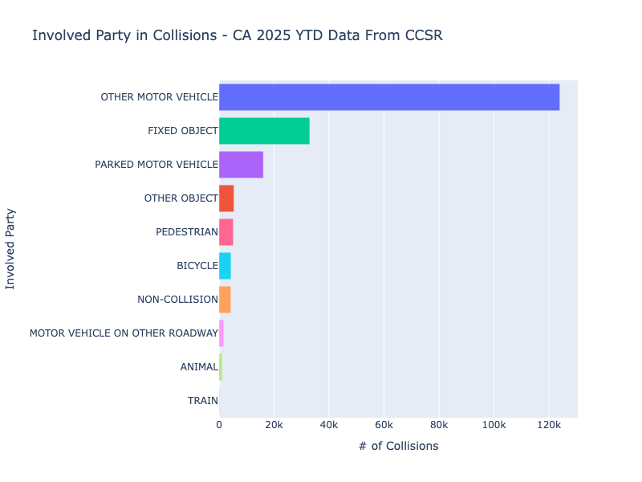
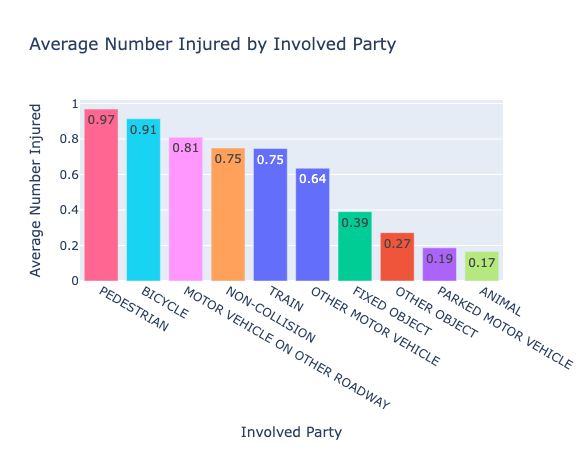
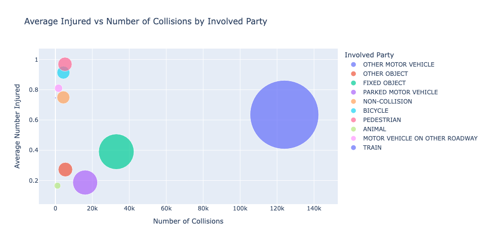
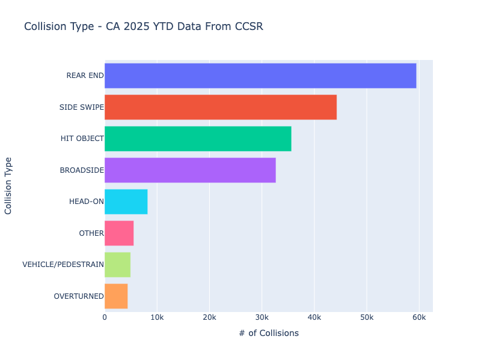
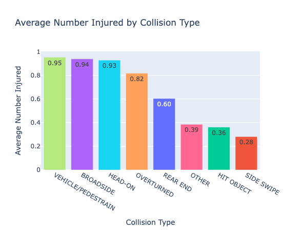
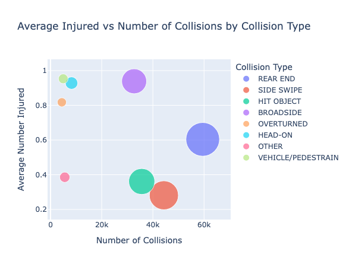

# Exploring Car Collision Patterns in California (2025 YTD)

**Data Source:** [California Crash Reporting System (CCRS)](https://data.ca.gov/dataset/ccrs)

Exploratory Data Analysis (EDA) of California’s 2025 year-to-date crash dataset.

## Tools & Libraries
- **Python** (Pandas, NumPy)  
- **Visualization**: Plotly, Matplotlib  
- **Data**: California Crash Reporting System (CCRS), 2025 YTD  

## Data Cleaning & Preparation
Data Prep:
- Standardized column names and reviewed data types and shape
- Removed columns with >70% missing values and irrelevant fields
- Verified `Collision_id` as a unique identifier
- Checked redundancy between `IsHighwayRelated` and `IsFreeway`
- Handled missing values and ensured dataset integrity

## Exploratory Data Analysis (EDA) and Visualizations
This section explores both **frequency** (how often collisions occur) and **severity** (how many people are injured) across two dimensions: **involved party type** and **collision type**.  
For each dimension, three complementary views are shown:  
- Frequency  
- Severity  
- The relationship between frequency and severity

### Involved Party Analysis
- **Frequency** – Other motor vehicles dominate, followed by fixed objects and parked vehicles.  
  

- **Severity** – Pedestrian and bicycle crashes have the highest average injuries.  
  

- **Frequency vs Severity** – Pedestrian crashes combine **high severity** with **top-5 frequency**.  
  

### Collision Type Analysis
- **Frequency** – Rear-end is most common, followed by side swipe, hit object, and broadside.  
  

- **Severity** – Vehicle–pedestrian, broadside, head-on, and overturned are most dangerous.  
  

- **Frequency vs Severity** – Broadsides combine **high frequency** and **high severity**, making them especially concerning.  
  
